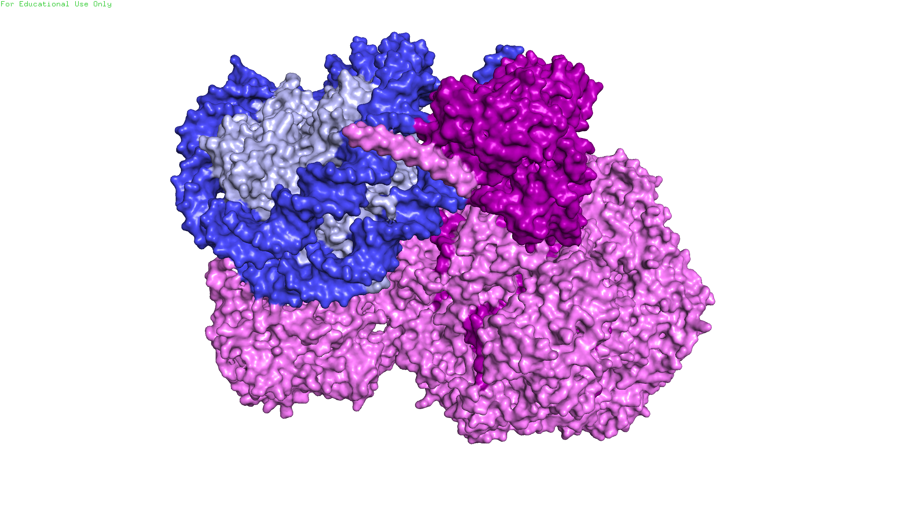
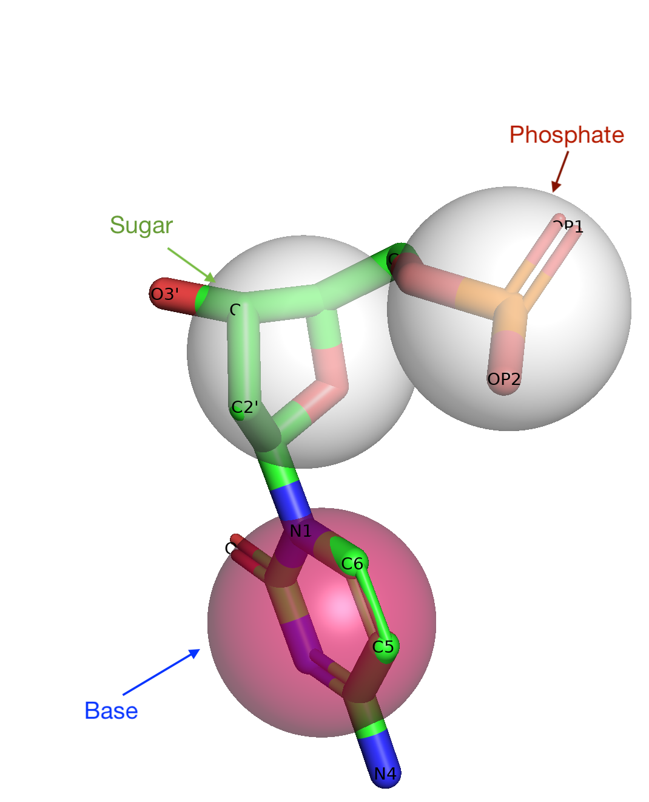
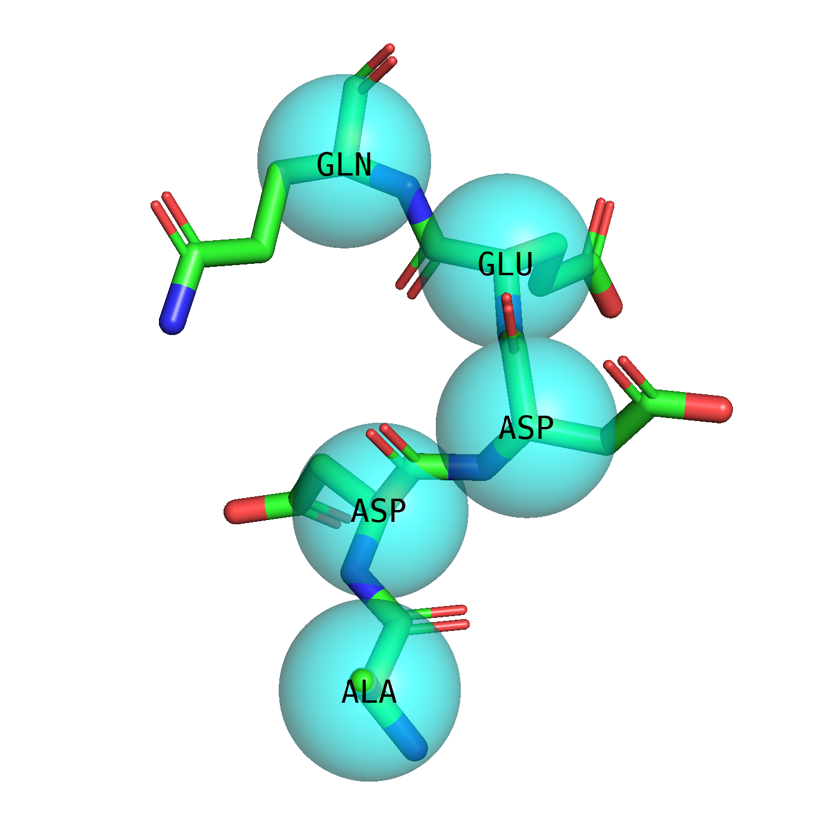

# CSCI596 Final Project: Coarse-Grain MD Simulation for Chromatin Remodeler INO80
#### Yibei Jiang


## I. Introduction

### 1. Chromatin Remodeler IN080 (PDB ID: 6fml)
<p align="center">
  
</p>
Chromatin Remodelers are protein complexes that can interact directly to consensed chromatin and displace nucleosomes to allow downstream Transcription Factors to access the underlying genomic DNA information. It does so using ATP hydrolysis. The recent influx of remodeler cystal structures shed lights on potential modes of nucleosome sliding but the detailed mechanism is unclear. Here, I investigated the mechanism of chromatin remodeler, INO80 using Coarse Grained Molecular Dynamics Simulations.

```
The Biological Question: 
What is the moleclar mechanism INO80 uses to slide the nucleosome using ATP hydrolysis?
```
## II. Methods
### 0. Coarse Grain Molecular Dynamics
Coarse Grain MD simulations map atoms into virtual particles called beads and, as a result, reduces the number of particles in the system and simplifies calculation. Using CG MD, we can simulate larger system for a longer time. The mapping scheme of each CG situation varies and application specific. Here, I used a 3SPN.2C model by [Hinckley et al.,2013](https://doi.org/10.1063/1.4822042) that is best suited for DNA and AICG2+ model by [Jones et al.](https://doi.org/10.1021/jacs.1c05219) for protein.

The general workflow to set up CG MD simulation for the Chromatin Remodeler is described below:
<p align="center">
  
</p>

A "**3 Sites per Nucleotide**" strategy is used to coarse grain DNA. Below is a sample CG scheme for a nucleotide C.
<p align="center">
  
</p>

A "**1 Site per Amino Acid**" strategy is used to coarse grain protein. Below is a sample CG scheme for a protein
sequence GLN-GLU-ASP-ASP-ALA.
<p align="center">
  
</p>

Now we obtain the entire Initial CG structure for this system.


### 1. Coarse Grain Molecular Dynamics For Chromatin Remodeler


## IV. Results

## II. Introduction
If the C compiler on your computer is cc (also common is gcc for Gnu C
compiler), type:
cc -O -o md md.c -lm
This will create an executable named md. To run the executable, type:
./md < md.in

## III. Methods
The following files are included in this folder, in addition to this readme
file, readme.md.
<ul>
<li>md.c: Main C program</li>
<li>md.h: Header file for md.c</li>
<li>md.in: Input parameter file (to be redirected to the standard input)</li>
</ul>


