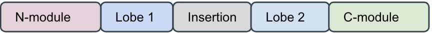
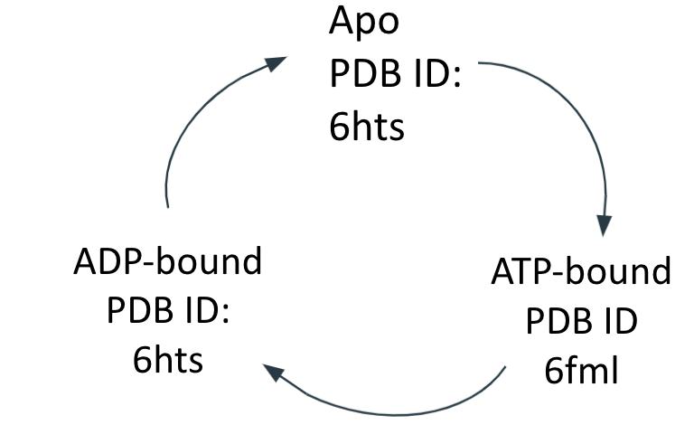

# CSCI596 Final Project: Coarse-Grain MD Simulation for Chromatin Remodeler INO80
#### Yibei Jiang


## I. Introduction

### 1. Chromatin Remodeler IN080 (PDB ID: 6fml)
<p align="center">
  
</p>

<p align="center">
  <b>Figure 1. INO80 Chromatin Remodeler Cryo-EM Structure</b>
</p>

Chromatin Remodelers are protein complexes that can interact directly to consensed chromatin and displace nucleosomes to allow downstream Transcription Factors to access the underlying genomic DNA information. It does so using ATP hydrolysis. The recent influx of remodeler cystal structures shed lights on potential modes of nucleosome sliding but the detailed mechanism is unclear. Here, I investigated the mechanism of chromatin remodeler, INO80 using Coarse Grained Molecular Dynamics Simulations.

```
The Biological Question: 
What is the moleclar mechanism INO80 uses to slide the nucleosome using ATP hydrolysis?
```
## II. Methods
### 1. Coarse Grain Molecular Dynamics
Coarse Grain MD simulations map atoms into virtual particles called beads and, as a result, reduces the number of particles in the system and simplifies calculation. Using CG MD, we can simulate larger system for a longer time. The mapping scheme of each CG situation varies and application specific. Here, I used a 3SPN.2C model by [Hinckley et al.,2013](https://doi.org/10.1063/1.4822042) that is best suited for DNA and AICG2+ model by [Li et al.,2014](https://doi.org/10.1073/pnas.1201807109) for protein.

The general workflow to set up CG MD simulation for the Chromatin Remodeler is described below:
<p align="center">
  
</p>

<p align="center">
  <b>Figure 2. CG MD Workflow for INO80</b>
</p>

A "**3 Sites per Nucleotide**" strategy is used to coarse grain DNA. 
Below is a sample CG scheme for a nucleotide Cytosine.
<p align="center">
  
</p>

<p align="center">
  <b>Figure 3. DNA CG Scheme</b>
</p>

A "**1 Site per Amino Acid**" strategy is used to coarse grain proteins. 
Below is a sample CG scheme for a protein with amino acid sequence GLN-GLU-ASP-ASP-ALA.

<p align="center">
  
</p>

<p align="center">
  <b>Figure 4. Protein CG Scheme</b>
</p>

### 2. Chromatin Remodeler Slides Nucleosome Using ATP Hydrolysis
Chromatin Remodelers are SNF2 family ATPases. They contain 2 lobes in its ATPase domain. 
<p align="center">
  
</p>

<p align="center">
  <b>Figure 5. SNF2 ATPase Domain Structure Has 2 Catalytic Lobes</b>
</p>

Previous CG simulation by [Brandani and Takada,2018](https://doi.org/10.1101/297762) has simulated the ATP Hydrolysis process (apo->ATP->ADP) through changing the **Hydrogen bond strength** and **lobe1-lobe2 Go interaction strength** to facilitate conformational change that allow the Lobe 2 to close up to Lobe 1. The details for Energy Calculation Functions of Go Interaction can be found [here](https://www.charmm.org/wiki//index.php/Coarse_Grained_Go_Models#The_functional_form_of_the_coarse-grained_Go_model). Inspired by their research, I adopted similar strategy to simulate DNA translocation by INO80 using ATP hydrolysis.
<p align="center">
  
</p>

<p align="center">
  <b>Figure 6. ATP Hydrolysis Cycle</b>
</p>

### 3. Define Translocase Lobe GO Contacts
The residues belong to lobe1 and lobe2 were identified using the [Cryo-EM structure 6fml](https://www.nature.com/articles/s41586-018-0029-y). This gives us the atpase in closed conformation. A simple homology model was constructed with [6hts](https://www.rcsb.org/structure/6HTS) to obtain the lobes in open conformation by aligning each of the two lobes with the respective ones from the [6fml](https://www.rcsb.org/structure/6fml) . A list of go interactions between lobes 1 and 2 are then generated (script: "mda_define_atp_contacts.py").
The strength of these contacts in each translocate state is set according to [Brandani and Takada,2018](https://doi.org/10.1101/297762):

|state|Interaction Strength|resulting state    |
|-----|--------------------|-------------------|
|apo  |0.0 kcal/mol        |preferably open    |
|ATP  |0.6 kcal/mol        |preferably closed  |
|ADP  |0.1 kcal/mol        |preferably open    |

**Table 1. Translocase lobes Go Interaction Strength per State**

### 4. Define DNA-Translocase Hydrogen Bonds
The hydrogen bonds are based on the all-atom (charmm27) conformation of the translocase
in complex with nucleosomal DNA as found in PDB 6fml with pdb2gmx. Hydrogen bonds with a cutoff distance of 5Å are identified (script: "mda_define_pdnsSnf2_cut5selmin.py").
The strength of hydrogen bonds in each translocate state is set according to [Brandani and Takada,2018](https://doi.org/10.1101/297762)

|state     |H Bond Strength|resulting state                            |
|----------|---------------|-------------------------------------------|
|apo       |1.8 kBT        |preferably open                            |
|ATP       |1.8 kBT        |preferably closed                          |
|ADP lobe1 |1.8 kBT        |preferably open                            |
|ADP lobe2 |1.44 kBT       |preferably unattach and translocate forward|

**Table 2. DNA-Translocase Hydrogen Bond Strength per State**

The analysis scripts are written in Python v3.6 with MDAnalysis v1.0.0.

### 5. Simulation
First, the CG initial state for INO80 is mimimized using Steepest Descend algorithm for 2X10<sup>7</sup> time steps
Then, I began production run for the DNA sliding activity of INO80 by running a simulation of an ATPase cycle with 3 states (apo-ATP-ADP), one after another. Each state was ran 2X10<sup>5</sup> timesteps with interactions strength modified as described in section 3 an 4 above. This CG MD simulation is performed using [CafeMOl3.0](https://doi.org/10.1021/ct2001045) with equation of motion via Constant temperature Langevin dynamics at 300K.

The last frame of the .dcd trajectory obtained from simulation is used as the intial structure to input file for the next states with changes in parameters in the bond strength files to simulate a whole ATP Hydrolysis cycle. 

## III. Results

First, we obtain the entire Initial CG structure for this system using the CG scheme described in the Methods Section.


<p align="center">
  <b>Figure 7. INO80 All Atom to CG Structure</b>
</p>

Next, we started simulation and below is the 2 second snapshots of the 3 state ATP Hydrolysis Cycle. 
In the videos below, 
-  `Lobe 1` is colored Cyan
-  `Lobe 2` is colored Green
-  `Insertion Domain` is colored Yellow
-  `DNA` is colored Orange
-  `Histones` are colored Grey

### 1. The apo state

https://user-images.githubusercontent.com/25398675/145734259-953bf084-7ddf-4d16-bad6-cc73560915d7.mov

### 2. The ATP state
 
https://user-images.githubusercontent.com/25398675/145734278-02dfc28b-47d3-47bc-86f5-0f86acb147d0.mov

### 3. The ADP state

https://user-images.githubusercontent.com/25398675/145734412-b5779603-70c9-4411-824d-ee4d52e42478.mov

## IV. Running Simulations
One will need to download and configure Cafemol software to run this simulation.
To identify GO contacts:
```
python3 mda_define_atp_contacts.py
```

To identify hydrogen bonds between histone and DNA:
```
python3 mda_define_nsgohb.py
```

To identify hydrogen bonds between translocase and :
```
python3 mda_define_pdnsSnf2_cut5selmin.py
```

To run the simulation with input file pt1.inp, type:
```
cafemol pt1.inp
```
