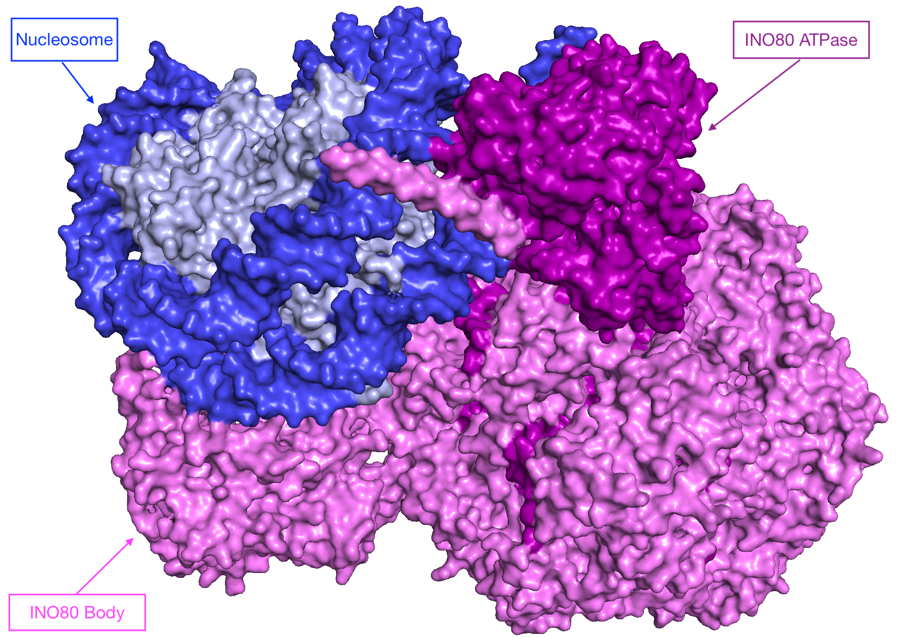

# CSCI596 Final Project: Coarse-Grain MD Simulation for Chromatin Remodeler INO80

## 0. Background

### Chromatin Remodelers

  

### Coarse Graining

A "3 Sites per Nucleotide" strategy is used to coarse grain DNA. Below is a sample CG scheme for a nucleotide C.

  

A "1 Sites per Amino Acid" strategy is used to coarse grain protein.Below is a sample CG scheme for a protein sequence ALA-ASP-ASP-GLU-GLN.

  

Now we obtain the entire Initial CG structure for this system.

## 1. Introduction
If the C compiler on your computer is cc (also common is gcc for Gnu C
compiler), type:
cc -O -o md md.c -lm
This will create an executable named md. To run the executable, type:
./md < md.in
## 2. Methods
The following files are included in this folder, in addition to this readme
file, readme.md.
<ul>
<li>md.c: Main C program</li>
<li>md.h: Header file for md.c</li>
<li>md.in: Input parameter file (to be redirected to the standard input)</li>
</ul>

## 2. Results
